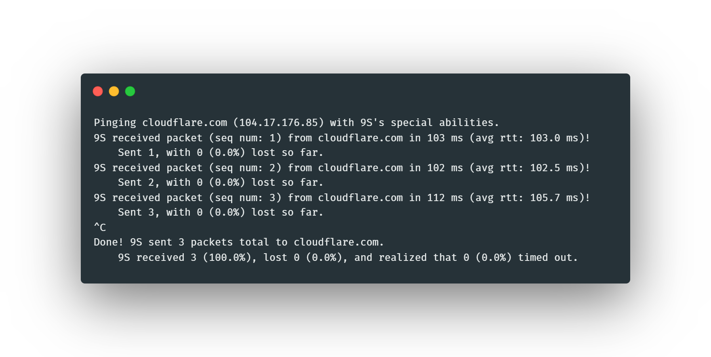

# 9S
Basic Rust program to send and receive pings.

This was created as a submission for Cloudflare's systems internship take-home assignment ([link](https://github.com/cloudflare-internship-2020/internship-application-systems)). The task was to create a `ping` program. This implementation satifies both the required and the extra-credit tasks. Many additional features were also implemented.

9S uses multiple threads to repeatedly send and receive pings concurrently. Press `Ctrl+C` (`SIGINT` or `SIGTERM`) to stop the program and print some statistics.

## Name
The name for this program is inspired by an android from the game NieR: Automata.

## Usage
First, confirm that you have Rust and Cargo installed, and you are running everything on a Linux machine.

Then, clone this repository:
```
git clone https://github.com/Daniel-Liu-c0deb0t/9S.git
cd 9S
```
After that, you can build and run 9S by simply running
```
./9S cloudflare.com
```
This will use `cargo` to pull and compile all dependencies. 9S only depends on `pnet`, `ctrlc`, and `dns_lookup`, but these crates have a ton of other dependencies, so compilation may take a while. Note that sending and receiving ICMP packets requires `sudo` permissions, so you will be prompted to enter your sudo password.

Sample output:


To run tests, run
```
./test.sh
```
The tests are just example pings with different command-line arguments.

## Arguments
Here is the help message given if you run `./9S --help`:
```
To build and run: ./9S [optional args] ADDRESS

Required args:
	 ADDRESS : IPv4/IPv6 address or hostname (autodetected), where the ICMP packets will be sent.

Optional args:
	-4 : Use IPv4. Default: autodetect.
	-6 : Use IPv6. Default: autodetect.
	--ttl TTL : Sets the time to live (hop limit) for all packets. Limitation: only works for IPv4. Default: 64.
	--timeout TIMEOUT_MS : Sets the time limit (in milliseconds) before a packet is categorized as timed out. Default: 5000 ms.
	--delay DELAY_MS : Sets the delay (in milliseconds) between sending each packet. Default: 1000 ms.
	--iter ITER : Sets the number of packets to be sent. Default: keep sending and don't stop.
	-h or --help : Prints this message and exit.

Each ICMP packet is strictly checked for matching identifiers, etc., so multiple programs can be sending pings at the same time.
```

## My Thoughts
I started this project with nearly zero knowledge in network programming. I am quite proud of how this turned out in just one week. Unfortunately, due to Rust lacking a solid networking library, and other external crates having many limitations/bugs, finishing this project was harder than expected. However, I still enjoyed programming in Rust.

## Note
I have not been able to test sending IPv6 packets on my home network. If ICMPv6 packets are being sent, but you are not getting any replies, then there could potentially be a problem in how the checksums are calculated for ICMPv6 packets. In this implementation, the source address is assumed to be all zeros.
